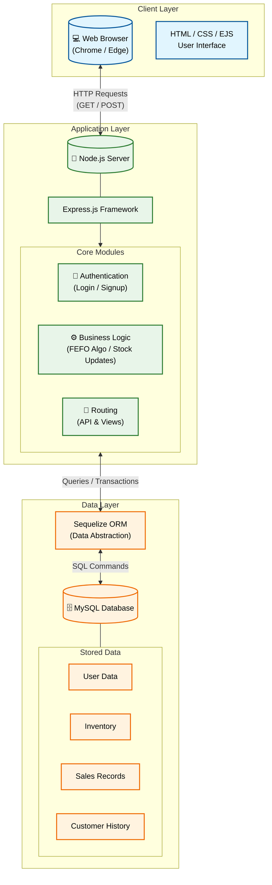

# Project Report: Pharma Stock - Smart Pharmacy Management System

## Table of Contents

1. [Overview of Project](#1-overview-of-project)
2. [Literature Review](#2-literature-review)
3. [System Block Diagram](#3-system-block-diagram)
4. [Project Methodology](#4-project-methodology)
5. [Technical Platform](#5-technical-platform)
6. [Database Design](#6-database-design)
7. [Expected Result](#7-expected-result)
8. [Scope of Further Improvements](#8-scope-of-further-improvements)
9. [References](#9-references)

---

## 1. Overview of Project

### 1.1 Introduction

**Pharma Stock** is a specialized web-based inventory management application designed specifically for pharmacies and medical stores. Unlike generic point-of-sale (POS) systems, Pharma Stock addresses the unique challenges of pharmaceutical inventory, primarily focusing on **medicine expiration** and **batch management**.

### 1.2 Problem Statement

The pharmaceutical retail sector faces distinct challenges that standard inventory software fails to address effectively:

- **Medicine Wastage:** A significant percentage of revenue is lost annually due to medicines expiring on the shelf.
- **Inefficient Tracking:** Traditional ledgers or basic Excel sheets often track total quantity (e.g., "100 strips of Paracetamol") but fail to distinguish between batches. This leads to a lack of visibility regarding which specific units are approaching expiration.
- **Human Error:** Without system guidance, shop owners often sell fresh stock (recently purchased) while older stock sits at the back of the shelf until it expires, resulting in financial loss.

### 1.3 The Solution

Pharma Stock acts as a digital "Smart Assistant" for chemists, providing:

- **Digitized Inventory:** A robust system that tracks stock not just by product name, but by **Batch Number** and **Expiration Date**.
- **FEFO Logic (First Expired, First Out):** The system is designed to prioritize the sale of goods that are expiring soonest, rather than those that arrived first (FIFO).
- **Multi-Tenant Architecture:** A secure, cloud-ready platform where multiple shop owners can manage their independent inventories on a single hosted instance, with strict data isolation.

### 1.4 Unique Selling Points (USP)

1.  **FEFO Algorithm:** The core differentiator. While most retail systems use FIFO (First-In-First-Out), Pharma Stock prioritizes Expiration Date. If Batch A expires in December and Batch B expires in June, the system guides the chemist to sell Batch B first, regardless of when it was bought.
2.  **Batch-Level Granularity:** Complete visibility into the lifecycle of every specific batch of medicine, ensuring compliance and safety.
3.  **SaaS-Ready Data Isolation:** The system supports multiple shop owners. Each user has a private, secure workspace for their data, making the platform scalable for wider deployment.

---

## 2. Literature Review

### 2.1 Existing Systems

Current market solutions for pharmacy management generally fall into two categories:

1.  **Legacy Desktop Software:** Often expensive, difficult to update, and lacking modern user interfaces. They typically require significant training to operate.
2.  **Generic POS Systems:** Cloud-based retail systems designed for general retail (clothing, groceries). These systems treat all units of a product as identical, ignoring the critical "expiry date" factor essential for medicine.

### 2.2 The Gap

There is a lack of affordable, modern, web-based solutions that specifically cater to the **expiry-critical** nature of pharmacy inventory for small-to-medium businesses. Most existing systems do not proactively alert users about expiring stock in a way that influences the point-of-sale workflow. Pharma Stock bridges this gap by making "Expiry Date" a first-class citizen in the data model.

---

## 3. System Block Diagram

_(Suggested Diagram: A high-level architecture diagram showing the flow of data)_

**Diagram Description:**

1.  **Client Layer:** Web Browser (Chrome/Edge) accessing the application via HTML/CSS/EJS interfaces.
2.  **Application Layer:** Node.js Server running Express.js. This handles:
    - Authentication (Login/Signup)
    - Business Logic (FEFO calculations, Stock updates)
    - Routing (API and View routes)
3.  **Data Layer:** MySQL Database.
    - Stores User Data, Inventory, Sales, and Customer records.
    - Managed via Sequelize ORM.

**Data Flow:**
`User (Browser) <--> HTTP Requests <--> Node.js/Express Server <--> Sequelize ORM <--> MySQL Database`



---

## 4. Project Methodology

The project follows the **MVC (Model-View-Controller)** architectural pattern, ensuring separation of concerns and maintainability.

### 4.1 Model (Data Layer)

Defined using **Sequelize**, a promise-based Node.js ORM.

- **Models:** `ShopOwner`, `Medicine`, `Customer`, `Sale`.
- **Relationships:** One-to-Many relationships link a Shop Owner to their specific Medicines and Sales, ensuring data privacy.

### 4.2 View (Presentation Layer)

Built using **EJS (Embedded JavaScript)** templating engine.

- Dynamic HTML pages that render server-side data.
- Responsive CSS for a clean user interface.
- Client-side JavaScript for interactive elements (search filtering, dynamic bill generation).

### 4.3 Controller (Business Logic)

Implemented within `server.js` (Express routes).

- **Authentication:** Middleware (`isAuthenticated`) protects sensitive routes.
- **Inventory Logic:** Handles adding, updating, and querying stock based on the logged-in user's ID.
- **Sales Logic:** Processes transactions, deducts stock from specific batches, and records customer history atomically using Database Transactions.

---

## 5. Technical Platform

### 5.1 Hardware Requirements

- **Server:** Standard Cloud Compute Instance (e.g., AWS EC2, Heroku) or Local Server.
- **Client:** Any device with a modern web browser (Laptop, Tablet, Smartphone).

### 5.2 Software Stack

- **Runtime Environment:** **Node.js** (JavaScript runtime).
- **Backend Framework:** **Express.js** (Minimalist web framework).
- **Database:** **MySQL** (Relational Database Management System).
- **ORM:** **Sequelize** (For abstracting SQL queries).
- **Frontend:** **EJS**, **HTML5**, **CSS3**, **Vanilla JavaScript**.
- **Authentication:** **bcrypt** (Password hashing), **express-session** (Session management).

---

## 6. Database Design

The database is normalized to ensure data integrity and efficient querying.

_(Insert Screenshot of Schema Diagram here)_

### 6.1 Key Tables

1.  **Shop Owners (`shop_owners`)**
    - Stores credentials and profile details of the pharmacy owners.
    - _Primary Key:_ `shop_owner_id`
2.  **Medicines (`medicines`)**
    - The core inventory table.
    - _Columns:_ `batch_no`, `expiry_date`, `quantity`, `stock_status`, `rack_no`.
    - _Foreign Key:_ `shop_owner_id` (Links medicine to a specific shop).
3.  **Customers (`customers`)**
    - Stores customer contact details for history tracking.
    - _Foreign Key:_ `shop_owner_id`.
4.  **Sales (`sales`)**
    - Transactional records of every item sold.
    - _Columns:_ `quantity_sold`, `total_amount`, `sale_date`.
    - _Foreign Keys:_ `med_id`, `cust_id`, `shop_owner_id`.

---

## 7. Expected Result

The implementation of Pharma Stock results in a fully functional, web-based inventory management system. The user interface is designed to be responsive, intuitive, and focused on minimizing clicks for high-frequency tasks like selling and searching.

### 7.1 User Interfaces

#### 1. Landing Page

The landing page serves as the public face of the application. It features a clean, modern design with a clear call-to-action ("Get Started").

- **Functionality:** It provides an overview of the platform's capabilities. If a user is already logged in, clicking "Get Started" intelligently redirects them to their dashboard instead of the login screen.
- _(Insert Screenshot of Landing Page here)_

#### 2. Authentication (Login & Signup)

Security is paramount. The system employs a secure authentication mechanism using encrypted passwords.

- **Functionality:** Users can create a new account or log in to an existing one. The forms include validation to ensure data integrity (e.g., password matching). Upon successful login, a session is created, isolating the user's data from others.
- _(Insert Screenshot of Login Page here)_

#### 3. Inventory Dashboard (View Stock)

This is the central hub for the shop owner. It displays a comprehensive list of all medicines currently in stock.

- **Functionality:**
  - **Search:** A real-time search bar allows users to filter medicines by Name, Batch Number, or Generic Name.
  - **Expiry Tracking:** The table clearly lists expiration dates, allowing the pharmacist to identify stock that needs to be pushed.
  - **Stock Status:** Visual indicators show if an item is "Available" or "Out of Stock".
- _(Insert Screenshot of View Stock Dashboard here)_

#### 4. Add Medicine Interface

A dedicated form for entering new inventory into the system.

- **Functionality:** This interface captures critical details often missed by simple ledgers, such as **Batch Number**, **Rack Number**, and **Expiry Date**. It enforces the "Prescription Required" flag, ensuring regulatory compliance.
- _(Insert Screenshot of Add Medicine Form here)_

#### 5. Point of Sale (Sell Stock)

The core operational screen designed for speed during customer interactions.

- **Functionality:**
  - **Batch Lookup:** The chemist enters a batch number to instantly retrieve medicine details (Price, Expiry, Availability).
  - **Bill Generation:** Items are added to a dynamic bill table which calculates the grand total automatically.
  - **Stock Deduction:** Upon confirming the sale, the system automatically deducts the specific quantity from the selected batch, ensuring the inventory count is always accurate.
- _(Insert Screenshot of Sell Stock Page here)_

#### 6. Customer History & Sales Log

A record-keeping interface that tracks business performance.

- **Functionality:** This page lists all past transactions, showing which customer bought what medicine and when. It is essential for tracking revenue and understanding sales trends.
- _(Insert Screenshot of Customer History Page here)_

### 7.2 Functional Outcomes

- **Accurate Inventory:** Real-time updates of stock levels prevents overselling.
- **Data Security:** Implementation of `shop_owner_id` filters ensures that User A cannot see or modify User B's stock.
- **Expiry Management:** The system successfully identifies medicines by batch, allowing the chemist to sell older stock first.

---

## 8. Scope of Further Improvements

The current version of Pharma Stock establishes a robust foundation. Future iterations will focus on automation and intelligence:

1.  **Integration with SMS API:**

    - Automatically send digital receipts to customers via SMS/WhatsApp.
    - Send "Refill Reminders" to patients for chronic medications (e.g., sending a reminder on the 28th day for a 30-day diabetes course).

2.  **AI-Based Demand Prediction:**

    - Analyze historical sales data to forecast demand.
    - Suggest re-order quantities to prevent both stockouts and overstocking of slow-moving items.

3.  **AI Medicine Scanner (OCR):**

    - Integrate a camera-based feature using Optical Character Recognition (OCR).
    - **Workflow:** Shop owner scans a medicine strip -> AI extracts Name, Batch, and Expiry -> Form auto-fills -> User confirms. This reduces manual data entry time by 90%.

4.  **Smart Stock History:**
    - The system will "learn" from previous entries. If "Dolo 650" was added previously with specific manufacturer and category details, typing "Dolo" in the future will auto-populate these static fields, requiring only dynamic data (Batch/Expiry) to be entered.

---

## 9. References

1.  **Node.js Documentation:** https://nodejs.org/en/docs/
2.  **Express.js Guide:** https://expressjs.com/
3.  **Sequelize ORM Manual:** https://sequelize.org/
4.  **MDN Web Docs (HTML/CSS/JS):** https://developer.mozilla.org/
5.  **MySQL Reference Manual:** https://dev.mysql.com/doc/

```

```
